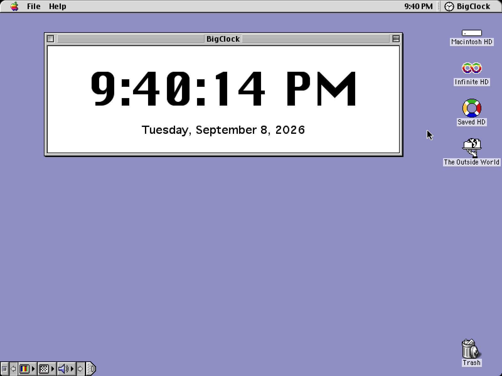
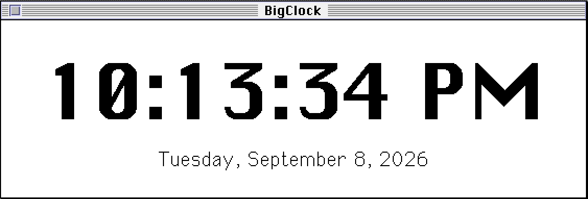

# BigClock for Classic Mac OS

[](https://github.com/geerlingguy/BigClock-Classic/actions/workflows/ci.yml)

A Big Clock for Classic Mac OS. That's it!

<p align="center"></p>

This was originally built for and tested on an iBook G3 running Mac OS 9.2, for [Jeff Geerling's](https://www.jeffgeerling.com) NTP timing exhibit at [VCF Midwest](https://vcfmw.org).

It should work on any Macintosh running System 7 or later (including Mac OS 7.6 or later). It will also run in the Classic environment on Mac OS X 10.0 through 10.4.11.

## Download

Download the [latest release](https://github.com/geerlingguy/BigClock-Classic/releases/latest).

Grab the appropriate build for your Mac's architecture (68k or PPC), or the FAT binary which runs on either architecture (at the cost of a little extra disk space).

The `.bin` file can be copied to your Mac and expanded with Stuffit Expander. The `.dsk` file is a disk image and can be mounted as or written to a floppy.

## Compiling for PowerPC

Compile within a [Retro68](https://github.com/autc04/Retro68) Docker build environment:

```
docker run --rm -v "$(pwd)":/root -i ghcr.io/autc04/retro68 /bin/bash <<'EOF'
cd /root && rm -rf build && mkdir build && cd build
cmake .. -DCMAKE_TOOLCHAIN_FILE=/Retro68-build/toolchain/powerpc-apple-macos/cmake/retroppc.toolchain.cmake
make
EOF
```

This should produce artifacts including:

  - `build/BigClock.bin`
  - `build/BigClock.dsk`

Copy `BigClock.bin` over to your Classic Mac and expand it with Stuffit Expander.

## Compiling for 68k

<p align="center"></p>

Build BigClock for 68k Macs using the following command:

```
docker run --rm --platform linux/amd64 -v "$(pwd)":/root -i ghcr.io/autc04/retro68 /bin/bash <<'EOF'
cd /root && rm -rf build68k && mkdir build68k && cd build68k
cmake .. -DCMAKE_TOOLCHAIN_FILE=/Retro68-build/toolchain/m68k-apple-macos/cmake/retro68.toolchain.cmake
make
EOF
```

Same as the PowerPC build, grab the `.bin` or `.dsk`, and run it!

The 68k version requires 32-Bit QuickDraw, which isn't supported on some of the oldest Macintoshes. But it should work back to at least System 7.0 or 7.1 on Mac II, LC, Quadra, etc.

## Compiling for both (Fat)

See the GitHub Actions CI workflow for instructions compiling a Fat binary, which will run on either PowerPC or 68k.

## Usage Notes

On laptops (like my iBook G3 Clamshell), 'power cycling' can disrupt the clock display's regularity. If you're seeing seconds jump a bit, go to Control Panels > Energy Saver > Advanced Settings > (uncheck) 'Allow processor cycling'.

## AI Disclosure

I built this with the assistance of Claude Fable 5.1, since I've never built a Classic Mac OS application before.
